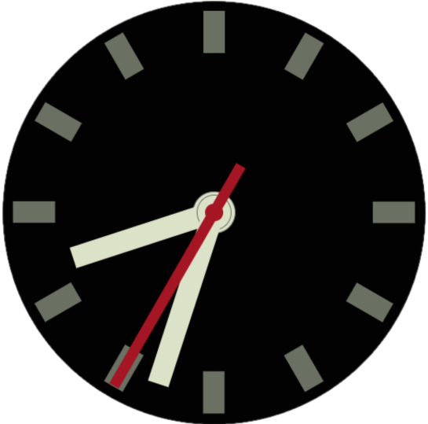
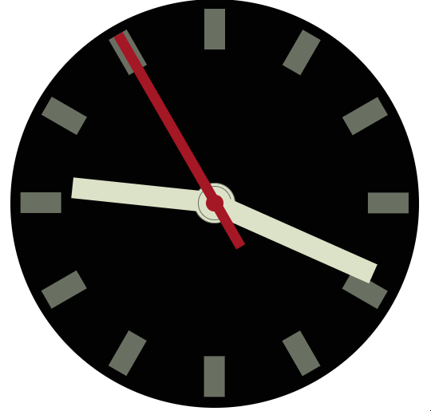

# Analog Clock

  

A simple analog clock. Made using `Expo` and `Reanimated`.

## 🚀 How to use

- Run `yarn` or `npm install`
- Run `yarn start` or `npm run start` to try it out.

## 📝 Notes

- [`react-native-reanimated` docs](https://docs.swmansion.com/react-native-reanimated/)

## Demo

